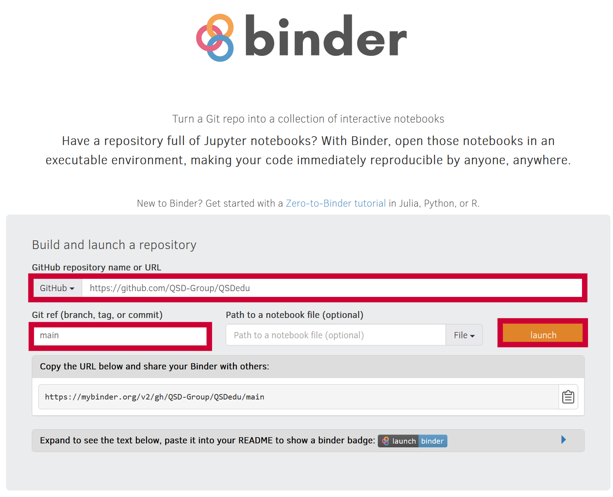

=============================================================
QSDedu: Education modules for Quantitative Sustainable Design
=============================================================

.. image:: https://mybinder.org/badge_logo.svg
   :target: https://mybinder.org/v2/gh/QSD-Group/QSDsan-env/main?urlpath=git-pull%3Frepo%3Dhttps%253A%252F%252Fgithub.com%252FQSD-group%252FQSDedu%26urlpath%3Dtree%252FQSDedu%252F%26branch%3Dmain

.. GitHub test of the main branch
.. image:: https://github.com/QSD-Group/QSDedu/actions/workflows/build.yml/badge.svg?branch=main
   :target: https://github.com/QSD-Group/QSDsan/actions/workflows/build.yml

.. Status
.. image:: https://img.shields.io/badge/status-under%20development-blue?style=flat

Launching Binder
----------------
Method 1
********
Directly click the |_binder_badge| above to launch binder in your browser.

.. |_binder_badge| image:: https://mybinder.org/badge_logo.svg

Method 2
********
If it takes a long time (or it times out), go to https://mybinder.org, enter the information as below:

* GitHub: ``https://github.com/QSD-Group/QSDedu``
* Git ref: ``main``

and click the `launch` button.

What is QSDedu?
---------------
QSDedu contains course modules for quantitative sustainable design (QSD), including the introduction of QSD methodology [1]_ and separate modules on using the packages developed by the `Quantitative Sustainable Design Group <https://github.com/QSD-Group>`_ for QSD of different engineered systems.

All tutorials are written using Jupyter Notebook, you can run your own Jupyter environment, or you can click the ``launch binder`` badge on the top to launch the environment in your browser.

Authors and Contributing
------------------------
Development of QSDedu is led by `Yalin Li <https://qsdsan.readthedocs.io/en/latest/CONTRIBUTING.html>`_ with contributions from the `Quantitative Sustainable Design Group <https://github.com/QSD-Group>`_.

We welcome contributions from the community! Please feel free to submit a GitHub issue for your questions and suggestions.

License information
-------------------
Please refer to the ``LICENSE.txt`` for information on the terms & conditions for usage of this software, and a DISCLAIMER OF ALL WARRANTIES.

References
----------
.. [1] Li, Y.; Trimmer, J.T.; Hand, S.; Zhang, X.; Chambers, K.G.; Lohman, H.A.C.; Shi, R.; Byrne, D.M.; Cook, S.M.; Guest, J.S. Quantitative Sustainable Design (QSD): A Methodology for the Prioritization of Research, Development, and Deployment of Technologies. (Tutorial Review) Environ. Sci.: Water Res. Technol. 2022, 8 (11), 2439–2465. https://doi.org/10.1039/D2EW00431C.
