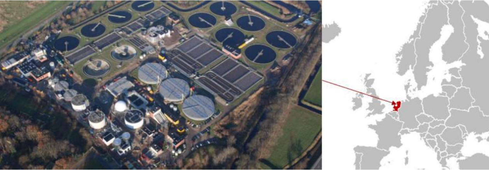
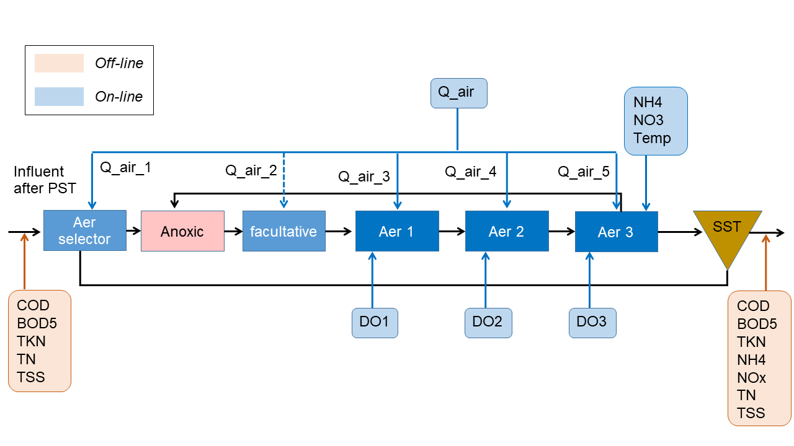

# Data-driven Models for Wastewater Treatment Plant

Wastewater treatment plants (WWTPs), also known as water resources recovery facilities (WRRFs), are integral components of urban water management, responsible for complex and partially observable processes that require monitoring and control to ensure stable, safe, and efficient operation. Modelling these facilities' biological, chemical, and physical processes is valuable for gaining process understanding, simulating and testing control strategies, and predicting future behavior under changing conditions. While engineers have traditionally favored mechanistic modelling approaches, data-driven methods are gaining increasing interest due to advancements in sensor technologies, enabling widespread data collection and real-time monitoring. For this project, you are tasked to develop models that use data from online sensors to predict certain effluent properties.

Materials and data for this module are based on the [WWTP model: mechanistic, data-driven, or hybrid?](https://www.kaggle.com/competitions/dynamic-modeling-of-wastewater-treatment-process/) Kaggle competition.


## Data Description

### General description of the WWTP
Tilburg WWTP (The Netherlands) is located in the south of The Netherlands and is the second largest wastewater treatment plant of Waterschap De Dommel. The plant has a design capacity of 350000 population-equivalent (P.E.), with its current organic load being approximately 360000 P.E. and the wastewater flow rates during dry and wet weather conditions, respectively, 2000 m3/h and 12585 m3/h. The plant has both water and sludge treatment lines and is considered as an "energy factory" converting the produced biogas to energy through combined heat and power (CHP) generation system. The water line is made up of three parallel trains, including primary clarifiers, biological treatment, chemical P-removal, and secondary clarifiers.



### Layout of the WWTP
The influent goes through the preliminary treatment (including screening and grid chamber) and primary sedimentation tanks (PST) before being introduced to the biological activated sludge treatment process (preliminary and primary treatments are not shown in the figure). After the PST, the influent flows into three parallel biological treatment lanes (AT1, AT2 and AT3). The AT line consists of an aerobic selector (SEL), a denitrification tank (DET), a facultative tank (DNT) and three consecutive aerobic nitrification tanks (NIT). The internal recycle flows from the end of the aerobic zone to the beginning of the denitrification tank where the return activated sludge is also being pumped to. The aeration is controlled through an ammonium-dissolved-oxygen (DO) cascade controller. The MLSS in the aeration tank is kept at around 4.5-5 g/L.



### Volumes and Flows
Volume of the anoxic tank: 10920 [m3]
Volume of the facultative tank: 10100 [m3]
Volume of each of the three aertion tanks: 11179 [m3]
Average internal recycle from aerobic to anoxic zone (nitrate recycle): 9800 [m3/h]
Average return activated sludge: 1600 [m3/h]
Average wastage flow: 30.5 [m3/h]

### Dataset
Online sensor measurements for:
**INPUT**
- Q_inf: total influent flow rate coming to the plant [m3/h]
- Q_air_1: Air flow rate supplied to the aerobic selector tank [m3/h]
- Q_air_2: Air flow rate supplied to the facultative tank [m3/h]
- Q_air_3: Air flow rate supplied to the first aerobic tank [m3/h]
- Q_air_4: Air flow rate supplied to the second aerobic tank [m3/h]
- Q_air_5: Air flow rate supplied to the third aerobic tank [m3/h]
- Temp: Temperature at the end of the aerobic zone [degC]
**OUTPUT**
- DO_1: Dissolved oxygen concentration in the first aerobic tank [mg/L]
- DO_2: Dissolved oxygen concentration in the second aerobic tank [mg/L]
- DO_3: Dissolved oxygen concentration in the third aerobic tank [mg/L]
- NO3: Nitrate concentration at the end of the aerobic zone [mg/L]
- NH4: Ammonium concentration at the end of the aerobic zone [mg/L]


## Evaluation
The accuracy of your results will be evaluated using Root Mean Squared Error (RMSE). It measures the average squared difference between the predicted values and the actual values. It takes the square root of the MSE, which makes it easier to interpret because it is in the same units as the dependent variable.

```math
RMSE = \sqrt{MSE} = \sqrt{\frac{1}{n}*\sum_{i=1}^n*(y_i-\hat{y_i})^2}
```

### Prompting Questions
* How do the different types of model compare with each other?
* In addition to RMSE, are there other criteria that can be used to evaluate the accuracy of the model?
* When developing a model, are there considerations in addition to accuracy?
* Does your model perform fairly well for all data? Or are there a couple of outliers?


## Citation
Ali Reza Dehghani Tafti, andrefro, Cristian Gómez, Elena Torfs, Junjie Zhu, Marcello Serrao, Mariane Schneider, Saba, sina borzooei, xu zou. (2023). WWTP model: mechanistic, data-driven, or hybrid?. Kaggle. https://kaggle.com/competitions/dynamic-modeling-of-wastewater-treatment-process