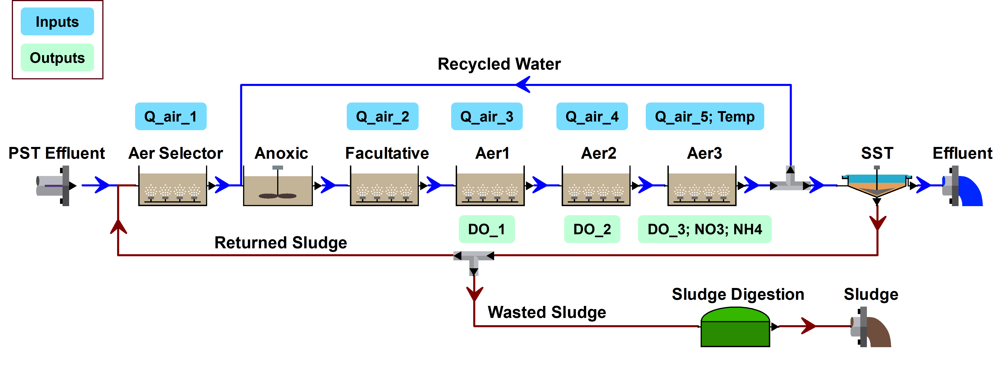

# Data-driven Models for Wastewater Treatment Plant

## Background

### How Do Wastewater Treatment Plant Work?

Wastewater treatment plants (WWTPs), also known as water resources recovery facilities (WRRFs), are integral components of urban water management. WWTPs use a combination of biological, chemical, and physical processes to remove contaminants from the wastewater so that it can be safely discharged into the environment.

:tv: Watch this [short video](https://go.rutgers.edu/howWWTPworks) made by the City of Townsville in Australia.

<div align="left">
      <a href="https://www.youtube.com/watch?v=ajv4lNq1Ta8">
         
      </a>
</div>


### Mechanistic vs. Data-driven Models

Modeling these facilities' biological, chemical, and physical processes is valuable for process control. While engineers have traditionally favored mechanistic modeling approaches, data-driven methods are gaining increasing interest due to advancements in sensor technologies, enabling widespread data collection and real-time monitoring.

:thought_balloon: What are mechanistic and data-driven models?

:bulb: **Mechanistic** models are models developed based on physical, chemical, or biological principles, while **data-driven** models rely purely on data to identify patterns and relationships without assuming underlying principles.


## Data Description

### General description of the WWTP
Tilburg WWTP is located in the south of The Netherlands :netherlands: and is the second largest wastewater treatment plant of Waterschap De Dommel.

The plant has a design capacity of 350000 population-equivalent. It has both water and sludge treatment lines. The water line includes primary sedimentation tanks, biological treatment, chemical phosphorus removal, and secondary sedimentation tanks.

It is also considered as an "energy factory" by generating biogas from anaerobic digestion. The biogas is converted to energy through a combined heat and power (CHP) generation system.


### Layout of the WWTP
The influent goes through the preliminary treatment (including screening and grit chamber) and primary sedimentation tanks (PST) before being introduced to the biological treatment processes, where microbes are used to remove organic contaminants and excess nutrients (mainly nitrogen).

The biological treatment train consists of an aerobic selector, an anoxic tank, a facultative tank, and three consecutive aerobic tanks. After which secondary sedimentation tanks (SST) separates the microbes (i.e., sludge) from the treated water.

The internal recycle flows from the last aerobic tank to the anoxic tank, and the return sludge is pumped to the aerobic selector.

:thought_balloon: What does aerobic, anoxic, facultative mean?

:bulb: Different microbial communities remove different contaminants from wastewater. Some microbes like oxygen (**aerobic**), some do not (**anaerobic** or **anoxic**), and some can survive with and without oxygen (**facultative**). Controlling the dissolved oxygen (DO) level is a very important operating strategy to control what microbes are in which tank.

:bulb: Both **anaerobic** and **anoxic** tanks have a DO of zero. But anoxic tanks have oxygen-containing chemicals (e.g., nitrate, NO3) while anaerobic tanks do not.




### Project Goal
:page_facing_up: For this project, you are tasked to develop data-driven models that use data from online sensors to predict the desired effluent properties.

Through online sensors, we have measurement for the following parameters (i.e., your model inputs):

- Q_inf: total influent flow rate coming to the plant [m3/h]
- Q_air_1: Air flow rate supplied to the aerobic selector tank [m3/h]
- Q_air_2: Air flow rate supplied to the facultative tank [m3/h]
- Q_air_3: Air flow rate supplied to the first aerobic tank [m3/h]
- Q_air_4: Air flow rate supplied to the second aerobic tank [m3/h]
- Q_air_5: Air flow rate supplied to the third aerobic tank [m3/h]
- Temp: Temperature at the end of the aerobic zone [degC]


We would like to know the value of the follow parameters (i.e., your model outputs):

- DO_1: Dissolved oxygen concentration in the first aerobic tank [mg/L]
- DO_2: Dissolved oxygen concentration in the second aerobic tank [mg/L]
- DO_3: Dissolved oxygen concentration in the third aerobic tank [mg/L]
- NO3: Nitrate concentration at the end of the aerobic zone [mg/L]
- NH4: Ammonium concentration at the end of the aerobic zone [mg/L]

:thought_balloon: Why do we care about these parameters?

:bulb: WWTPs are required by regulations to reduce NH4 and NO3 to certain levels.

:bulb: Wastewater engineers can use DOs to diagnose the performance of different microbial communities. We want DOs to be just sufficient to support the microbes we want, because to increase DO, we need to pump air into the wastewater, and this uses a LOT of energy (aeration is the most energy-consuming process of wastewater treatment).


## Evaluation
The accuracy of your results will be evaluated using Root Mean Squared Error (RMSE). It measures the average squared difference between the predicted values and the actual values. It takes the square root of the MSE, which makes it easier to interpret because it is in the same units as the dependent variable.

```math
RMSE = \sqrt{MSE} = \sqrt{\frac{1}{n}*\sum_{i=1}^n*(y_i-\hat{y_i})^2}
```

## Prompting Questions
- How do the different types of model compare with each other?
- In addition to RMSE, are there other criteria that can be used to evaluate the accuracy of the model?
- When developing a model, are there considerations in addition to accuracy?
- Does your model perform fairly well for all data? Or are there a couple of outliers?
- Do the more advanced models (e.g., neutral network) perform better than the simpler regression models? Why or why not?


## Citation
This module was developed by [Prof. Yalin Li](https://yalinli.group) based on the [WWTP model: mechanistic, data-driven, or hybrid?](https://www.kaggle.com/competitions/dynamic-modeling-of-wastewater-treatment-process/) Kaggle competition.